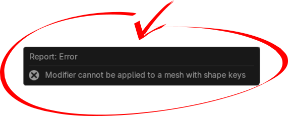
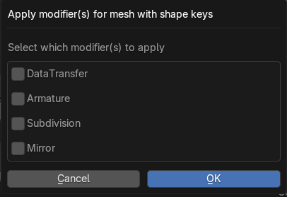

# Apply Modifiers to Mesh with Shape Keys

This is a Blender add-on that applies any modifiers to a mesh that has shape keys. It will apply any of the modifiers you select, restore all the settings, drivers, and any animation data on the shapes.

If you run into the problem below, this add-on will let you apply that modifier.  

## Installation

### Method 1: From Blender Extensions Platform

1. Open **Blender** and go to **Edit > Preferences > Get-Extensions**.
2. In the **Get-Extensions** tab, click **Install...** at the top right of the window.
3. Search for the add-on by name in search bar, and click **Install** to enable it.

### Method 2: Manual Installation

1. Download the add-on `.zip` file.
2. In Blender, go to **Edit > Preferences > Add-ons**.
3. Click the **Install...** button at the top of the preferences window.
4. Select the `.zip` file you downloaded and click **Install Add-on**.
5. Enable the add-on by checking the box next to **Apply Modifiers to Mesh with Shape Keys**.

Once the add-on is installed, make sure to enable it with the checkbox in the Add-ons tab.

## Usage

The add-on will only be available for **Mesh objects** in **Object Mode**.

It can be found in the **Shape Key Context Menu** or by using the search function.

### Shape Key Context Menu

### F3 Search
You can also search for it in the 3D Viewport by pressing **F3** and typing **"Apply Modifiers with Shape Keys"**.

  

After activating the tool you will see a popup dialog box.  

### Checkboxes

Chose which modifiers to apply and click OK

### Exclude Armature Deformation

If there is an armature modifier on the active mesh (and it is enabled).  You will see an option to exlcude this deformation when applying the other modifiers.  This will temporarily disable the armature modifier so it does not influence the mesh when the other modifiers are being applied and will be re-enabled at the end.

## How it Functions

1. **Duplicate Mesh**:  
    - The add-on creates a duplicate of the original mesh, removes all the shape keys, and applies the selected modifier(s).

2. **Loop through Shape Keys**:  
    - For each shape key, it creates another duplicate of the mesh.
    - It applies just that single shape key along with the selected modifier(s).
    - It then merges this modified shape key back into the original mesh.

3. **Restore Shape Keys**:  
    - After processing all the shape keys, the add-on restores the original shape key values, animation data, and drivers (if applicable) on the original mesh.

This process is done one shape key at a time to reduce the memory load on your machine, which is important if you're working with a high-density mesh (e.g., 200+ copies of a complex mesh).

## Troubleshooting

Theoretically, if you can apply the modifiers to the base shape and all your shape keys and the resulting meshes have the same number of vertices, the add-on will work with any modifier.

However, as you may know, several Blender modifiers can change the number of vertices on the base mesh (e.g., Subdivision Surface, Mirror modifier with Bisect or Merge enabled, Geometry Nodes, etc.). This can cause problems because Blender can only join meshes with shape keys if they have the same number of vertices.

### What to Do If the Add-on Doesn't Work as Expected

If your attempt to apply the modifiers is incomplete or results in an error, **undo the operation and consider the following tips**.

#### Try a Different Order of Modifiers:
Certain modifiers can cause problems when applied in a specific order. For example:
- **Subdivision** followed by **Mirror (with Bisect)** could fail, especially if any shape keys move vertices away from the mid-line.
- Try applying the modifiers in the opposite order to see if that resolves the issue.

#### Apply Modifiers One at a Time:
Instead of applying multiple modifiers at once, try applying them individually. This can help pinpoint which modifier is causing the issue. For example, if a combination of **Subdivision** and **Mirror** fails, applying them one at a time might help identify which one is the problem.

#### Remove a Troublesome Shape Key:
Is there a specific shape key that causes the operation to fail?  
If you can identify it, try removing that particular shape key. Once the problematic shape is removed, the others may succeed. You can always rebuild the troublesome shape afterward.

#### Geometry Nodes:
The add-on is designed to work with **mesh objects**. If you're using a **Geometry Nodes** setup, make sure that the output is a mesh object (not instances, for example). You may need to "realize" the instances so the output is truly a mesh object.  

